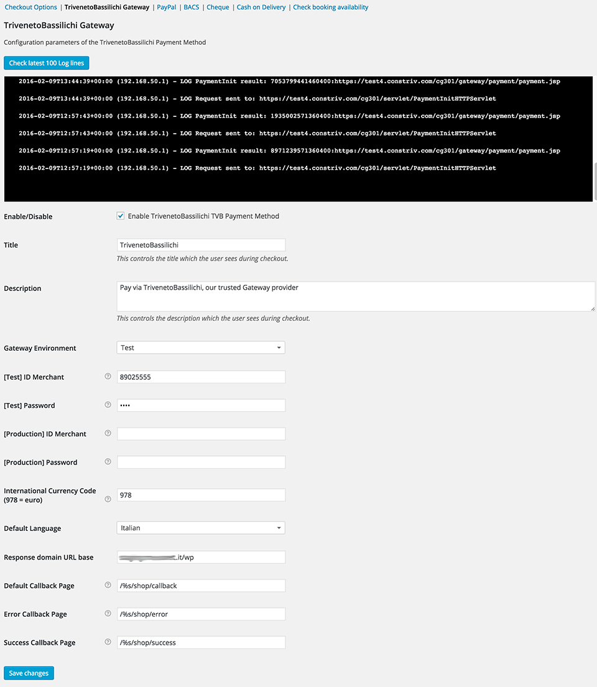

# WooCommerce Triveneto Gateway

Open Source plugin to add the [Consorzio Triveneto](http://www.constriv.it/) Gateway to WooCommerce.

## Install

1. Copy the folder `woocommerce-triveneto-gateway` inside `wp-content/plugins`
2. Activate the plugin from `Dashboard > Plugins`

## Configuration

Go to **WooCommerce > Settings > Checkout** and select the **TrivenetoBassilichi Gateway** tab

You'll be able to see a log of the latest activity and an array of settings:

## Disclaimer

Use at your own risk, this is not an official plugin nor I have anything to do with Triveneto.

This plugin is heavily based on [Davide Gullo's PgConsTriv PHP library](http://www.m4ss.net/os-open-source/payment-gateway-consorzio-triveneto-php-class/).

I just adapted his PHP wrapper for WooCommerce use.

Thanks and hope somebody finds this useful.
